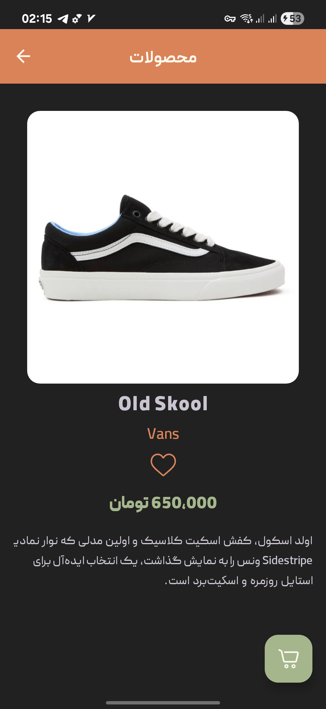
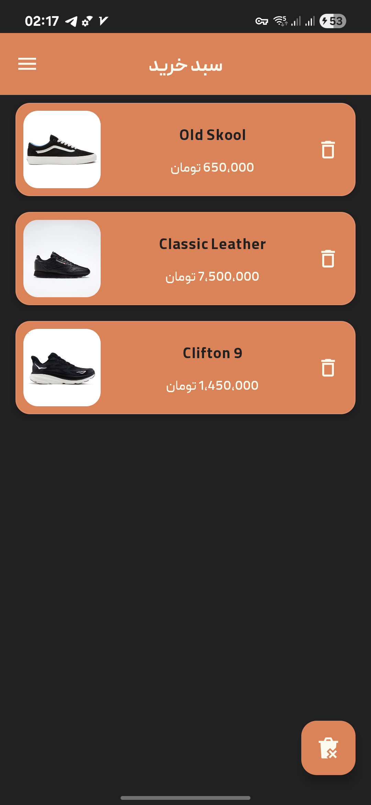
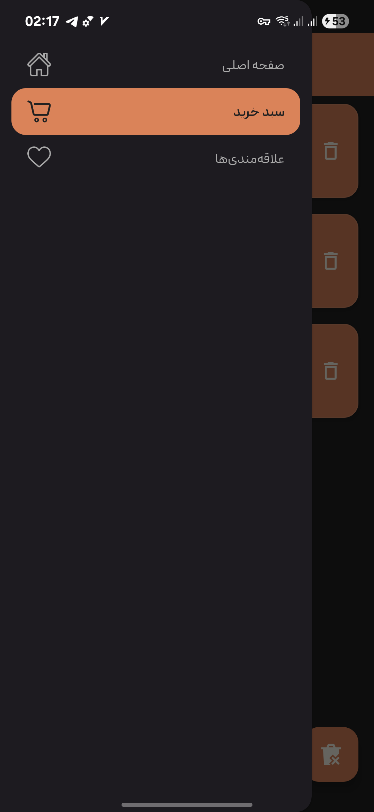

# 👟 ShoesStoreApp - A Modern Android E-Commerce App

   

A modern, feature-rich e-commerce shoe store application built with 100% Kotlin and Android's **XML View system**. This project showcases a robust, scalable architecture based on MVVM and Clean Architecture principles, demonstrating proficiency in the latest Android Jetpack libraries and best practices.

## ✨ App Demo & Animations

This application features a polished user experience with smooth, meaningful animations powered by the Material Motion library and the Android Transition framework.

  

| Home (Light) | Details (Dark) | Cart | Navigation Drawer
| :---: | :---: | :---: | :---: |
|  |  |  |  |

---
## 🚀 Features

* **Modern MVVM Architecture:** A clean, scalable architecture separating UI, domain, and data layers.
* **State-Driven UI:** A reactive UI using `LiveData` and **Data Binding** to respond to state changes from ViewModels.
* **Home Screen:** Displays a grid of products with a professional **Shimmer loading effect**.
* **Detail Screen:** Navigation to a rich product detail view with a stunning **Shared Element Transition** animation.
* **Live Search:** Real-time product filtering based on user input.
* **Shopping Cart & Favorites:** Persist user data (cart & liked items) locally using a **Room** database.
* **Polished UX:**
    * Seamless navigation via a **Navigation Drawer**.
    * Smooth fragment transitions using **Material Motion**.
    * Custom, interactive **Snackbars** with actions.
* **Custom Theming:** Full support for **Light/Dark** themes with custom fonts and colors.

---

## 🛠️ Tech Stack & Architecture

This project is built upon a foundation of industry-standard tools and libraries to create a scalable and maintainable application.

| Component | Implementation |
| --- | --- |
| **Language** | [Kotlin](https://kotlinlang.org/) |
| **Architecture** | [Clean Architecture Principles](https://blog.cleancoder.com/uncle-bob/2012/08/13/the-clean-architecture.html) \| [MVVM](https://developer.android.com/topic/architecture) \| Repository Pattern \| `UiState` Management |
| **UI** | [XML Views](https://developer.android.com/guide/topics/ui/declaring-layout) \| [Data Binding & View Binding](https://developer.android.com/topic/libraries/data-binding) \| [Material 3](https://m3.material.io/) |
| **Dependency Injection**| [Hilt](https://dagger.dev/hilt/) |
| **Asynchronous** | [Coroutines](https://kotlinlang.org/docs/coroutines-overview.html) \| [Flow](https://kotlinlang.org/docs/flow.html) |
| **Database** | [Room](https://developer.android.com/training/data-storage/room) for local persistence |
| **Navigation** | [Navigation Component](https://developer.android.com/guide/navigation) with [Safe Args](https://developer.android.com/guide/navigation/navigation-pass-data#Safe-args) |
| **Image Loading** | [Coil](https://coil-kt.github.io/coil/) |
| **UI Effects** | [Shimmer (Facebook)](https://github.com/facebook/shimmer-android) \| [AndroidX Transitions](https://developer.android.com/training/transitions) |

---

## ⚙️ Setup and Build

To run this project:
1.  Clone the repository.
2.  Open the project in the latest version of Android Studio.
3.  Build and run. The project uses a mock data source and does not require an API key.

---

## 👤 Author

**Milad Goli**
* GitHub: [@miladgoli](https://github.com/miladgoli)
* Linkedin: [@miladgoli](https://www.linkedin.com/in/milad-goli)

---

## Find this repository useful? ❤️

Support it by joining **[stargazers](https://github.com/miladgoli/ShoeStoreApp/stargazers)** for this repository. ⭐
And **[follow](https://github.com/miladgoli)** me for my next creations! 🤩
